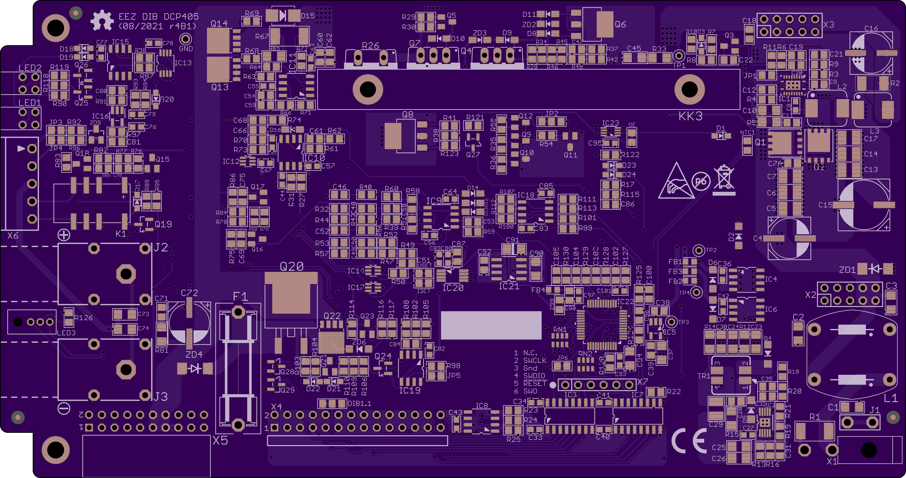

### Preliminary design

A new version of the [EEZ DIB DCP405](https://www.envox.eu/dc-power-modules/dcp405-power-module/) power module that has its own MCU and improved remote control (now for both CV and CC modes). This is a preliminary design that has been tested, but for which firmware needs to be developed. When the design is ready, it will be moved to the [main](https://github.com/eez-open/modular-psu/tree/master/dcp405) folder of this module.

