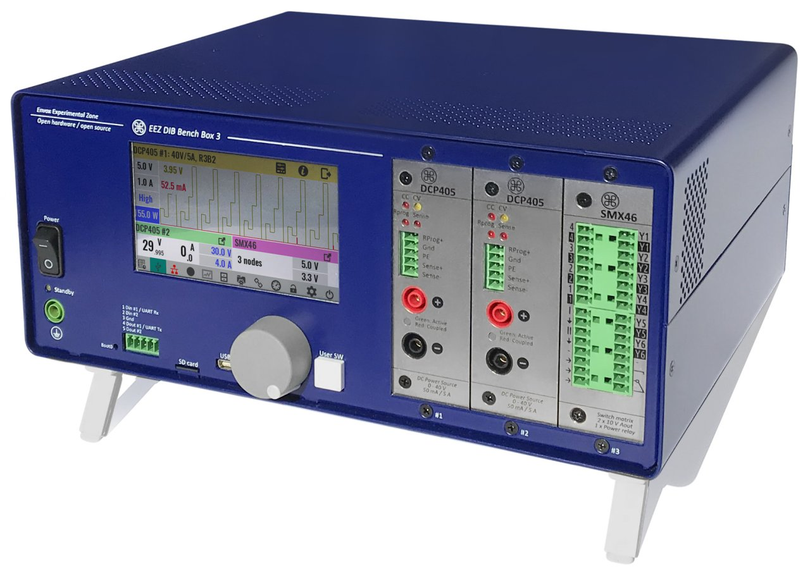
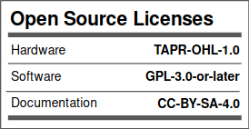

 

### Ownership and License
The contributors are listed in CONTRIB.TXT. 

Licenses | OSHWA UID
--|--
 | 

### Introduction

EEZ Bench Box 3 (BB3) represents a new category of *modular* Test and Measurement (T&M) equipment. It provides a complete open-source hardware and software framework that bridges the gap between – and combines the best features of – DIY hobbyist tools and professional benchtop equipment. 
BB3 was inspired by the [EEZ H24005](https://github.com/eez-open/psu-hw) power supply project ([OSHWA UID HR000001](https://certification.oshwa.org/hr000001.html)), which attracted many enthusiasts with its broad feature-set, rich user interface, DIY-friendliness, and fully open-source design. 
It initially comes with two DC power modules (hence the name of repository *modular-psu*) and will be expanded with new T&M modules (e.g. multi-channel power source, 2/4-quadrant power module, multi-channel temperature sensor module, data logger, switch matrix, digital I/O expander, function generator, data acquisition module, etc.). 
BB3 is made up of the following components:

* _[BP3C](https://github.com/eez-open/modular-psu/tree/master/bp3c)_ EEZ DIB backplane with power output coupling capability of first two modules
* _[AUX power supply](https://github.com/eez-open/modular-psu/tree/master/aux-ps)_ board with AC input protection, soft-start/power-up control, DC fan controller and +5 V / +12 V power outputs
* _[MCU](https://github.com/eez-open/modular-psu/tree/master/mcu)_ board based on STM32F769IIT6 32-bit ARM Cortex-M7
* _[DCP405](https://github.com/eez-open/modular-psu/tree/master/dcp405)_, 0 - 40 V / 50 mA / 5 A DC power source module
* _[DCM224](https://github.com/eez-open/dib-dcm224)_, dual sync buck 1 - 24 V / max. 4.9 A module
* _[Metal enclosure](https://github.com/eez-open/modular-psu/tree/master/enclosure)_ for housing up to 3 modules with 4.3" TFT LCD. Dimensions: 290 (W) x 123 (H) x 240 (D) mm

### Supported technologies

* _EEZ Flow_ (Visual programming tool for test and measurement automation)
* SCPI (Reference Guide in [PDF](https://github.com/eez-open/modular-psu-firmware/blob/master/docs/SCPI%20reference%20guide/EEZ%20BB3%20SCPI%20reference%20guide.pdf))
* MicroPython (script [examples](https://github.com/eez-open/modular-psu-firmware/tree/master/scripts), an example [video](https://www.youtube.com/watch?v=I0y6fgv8G00))
* MQTT (an intro [video](https://www.youtube.com/watch?v=THyfLSSAhrI))
* Node-RED integration (an intro [video](https://www.youtube.com/watch?v=0xQ6Xuq53fA))

### Other DIB modules

* [MIO168](https://github.com/eez-open/dib-mio168) Mixed I/O module
* [PREL6](https://github.com/eez-open/dib-prel6) power relays module
* [SMX46](https://github.com/eez-open/dib-smx46) programmable switch matrix module
* [MUX14D](https://github.com/eez-open/dib-mux14d) dual 7:1 reed relay 2-wire multiplexer

### Related topics and links

* EEZ BB3 [firmware](https://github.com/eez-open/modular-psu-firmware)
* [EEZ Studio](https://www.envox.eu/studio/studio-introduction)
* EEZ [DIB v1.0](https://github.com/eez-open/modular-psu/tree/master/DIB) specification
* [Discord](https://discord.gg/dhYMnCB) server
* [Twitter](https://twitter.com/envox)
* [YouTube](https://www.youtube.com/c/eezopen) channel
* [EEVblog forum](https://www.eevblog.com/forum/projects/eez-h25005-a-possible-successor-of-eez-h24005-programmable-power-supply/) discussion
* [Crowd Supply](https://www.crowdsupply.com/envox/eez-bb3) crowdfunding landing page
* [EMC certificate](https://www.envox.eu/?smd_process_download=1&download_id=2806), [LVD cerificate](https://www.envox.eu/?smd_process_download=1&download_id=2808)
* [Sigrok](https://sigrok.org/wiki/Envox_EEZ_Bench_Box_3)
* [Liberpay](https://liberapay.com/eez-open/donate) donations

### Where to buy?

* [EEZ Web store](https://www.envox.eu/store)
* [Mouser](https://www.mouser.com/Search/Refine?Keyword=cs-bb3-) (kit only, excl. EU)
* [Crowd supply](https://www.crowdsupply.com/envox/eez-bb3) (kit only, excl. EU)
---
Please note that some previous board types and revisions that could be still usable in some cases can be found under *[previous design](https://github.com/eez-open/modular-psu/tree/master/previous%20designs)* folder.
