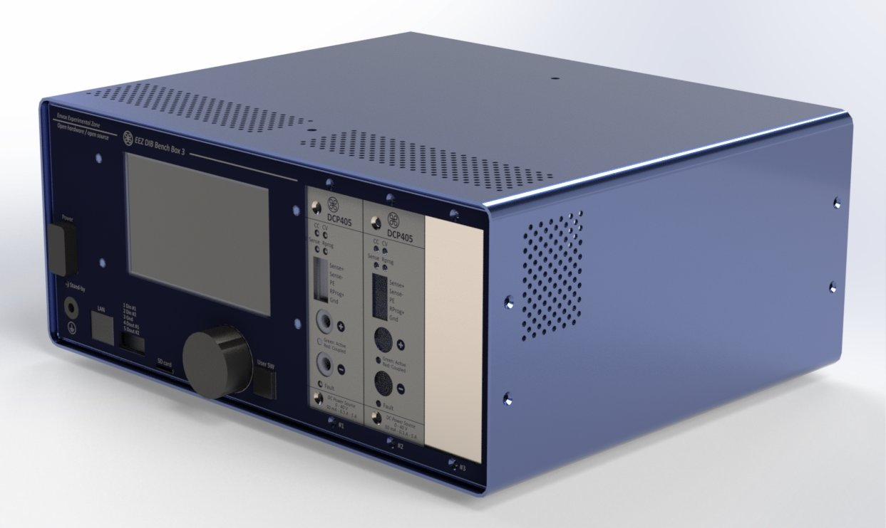

Modular programmable bench power supply is based on [EEZ H24005](https://github.com/eez-open/psu-hw) project and introduce new digital control and better modularity by using EEZ DIB backplane based on [DIB v1.0 specification](https://github.com/eez-open/modular-psu/tree/master/DIB v1.0) that allows adding of new functions in the future (e.g. multi-channel power source, 2/4-quadrant power module, multi-channel temperature sensor module, data logger, switch matrix, digital I/O expander, function generator, data acquisition module, etc.). 
It is work in progress and it's conceived to have the following components/modules:

* _[BP3C](https://github.com/eez-open/modular-psu/tree/master/bp3c)_ EEZ DIB backplane with series/parallel power coupling capability of first two modules
* _[AUX power supply](https://github.com/eez-open/modular-psu/tree/master/aux-ps)_ board with AC input protection, soft-start/power-up control, DC fan controller and +5 V / +12 V power outputs
* _[MCU](https://github.com/eez-open/modular-psu/tree/master/mcu)_ board based on STM32F769IGT6 32-bit ARM Cortex-M7 as replacement for Arduino Due
* _[DCP405](https://github.com/eez-open/modular-psu/tree/master/dcp405)_, an EEZ H24005 [Power module](https://github.com/eez-open/psu-hw/tree/master/Power%20board) variant (require an off-the-shelf fixed output 48 Vdc AC/DC power module)
* _[Bench Box 3](https://github.com/eez-open/modular-psu/tree/master/enclosure)_ metal enclosure for housing up to 3 modules with 4.3" TFT LCD. Dimensions: 290 mm (W) x 120 mm (H) x 240 mm (D)

### _Bench Box 3_ enclosure 3D model

Please note that some previous board types and revisions that could be still usable in some cases can be found under *previous design* folder.