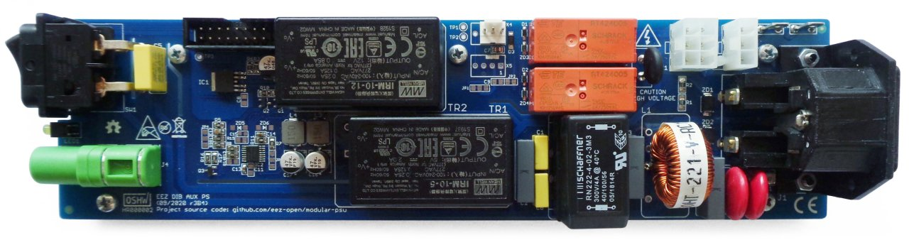

### Overview

_IMPORTANT: A crowdfunded version of the AUX-PS (r3B3) can be found [here](https://github.com/eez-open/modular-psu/tree/master/previous%20designs/aux-ps%20r3B3%20(Crowd%20Supply%20edition))._

AUX Power supply board for powering MCU board and backplane. It includes fan controller and AC power control with softstart (inrush current limiter) for power modules like DCP405 and DCM224.

### Feature list

* On-board IEC C14 AC inlet with dual 20 x 5 mm fuses
* On-board AC power switch
* AC input protection (SAR, MOV)
* AC input filter for EMI compliance
* 3 x AC power outputs
* Soft-start/standby relay control
* +5 V, 10 W (optional 20 W)
* +12 V, 10 W
* I2C DC fan controller with temperature sensor and speed control
* Two 3-wire or 4-wire 12V DC fans (standard PC fan pinout)
* Standby LED indictor
* On-board PE 4 mm terminal
* AC mains frequency detection (optional)
* Dimensions: 230.5 x 60 mm, 2-layer PCB
* **CE certified design**
