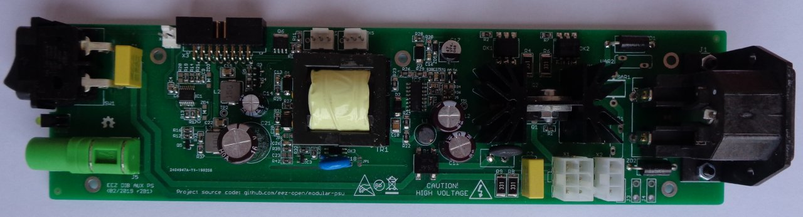

AUX Power supply board for powering MCU board and backplane.

### Feature list

* On-board IEC C14 AC inlet with dual 20 x 5 mm fuses
* On-board AC power switch
* AC input protection (SAR, MOV, TVS)
* 3 x AC power outputs
* Soft-start/start-up control
* +5 V, min. 2 A
* +12 V, min. 0.5 A
* I2C DC fan controller with temperature sensor and speed control
* Two 3-wire or 4-wire 12V DC fans (standard PC fan pinout)
* Stand-by LED indictor
* On-board PE 4 mm terminals
* Dimensions: 230.5 x 60 mm, 2-layer PCB

### Prototype r2B1

