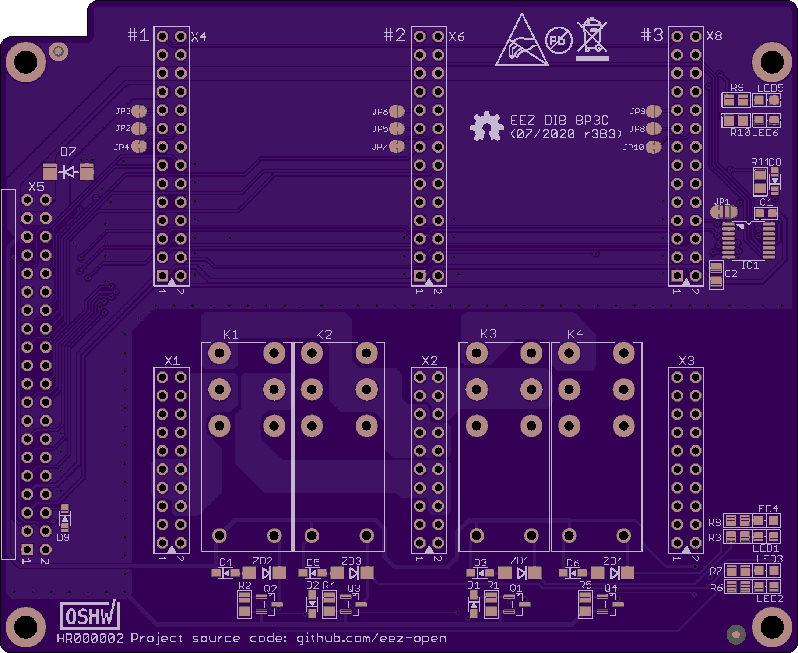

EEZ DIB BP3C is backplane for connecting up to three EEZ DIB power modules. Power outputs of first two modules is possible to coupled in series or parallel to double max. output voltage or current.

### PCB preview (r1B4)

