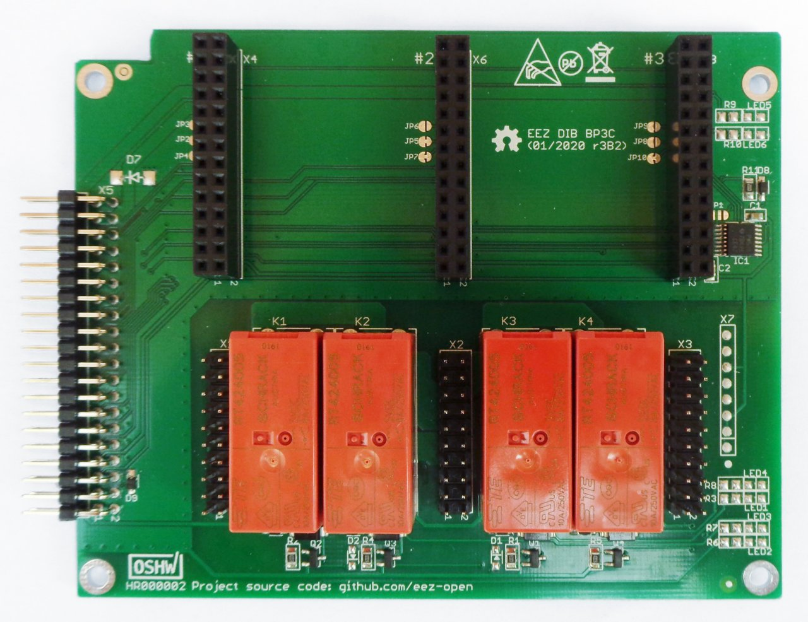

EEZ DIB BP3C is backplane for connecting up to three EEZ DIB peripheral modules. When power modules (e.g. [DCP405](https://github.com/eez-open/modular-psu/tree/master/dcp405)) are plugged into slot #1 and #2, their outputs can be combined under firmware control in one of the following way:

- Serial coupling to double max. output voltage 
- Parallel coupling to double max. output current
- Ch#1 `Out-` and Ch#2 `Out+` coupling for split rail output

Additionaly, it is possible to couple `Out-` terminals of all installed power modules (common GND).

The BP3C backplane provides dedicated BOOT output for each peripheral module that comes with on-board MCU and which firmware could be uploaded via SPI or UART. Programmable reset output is also featured that firmware upload procedure can be initiated without power recycling.

Dimensions: 110 x 90 mm, 2-layer PCB

### KiCad project (v7 or newer)

* [BP3C r3B3](https://github.com/eez-open/modular-psu/tree/master/bp3c/EDA%20files/KiCad)

All symbols, footprints and 3D models used in the project can be found in the [EEZ-DIB Library](https://github.com/eez-open/eez-kicad-libraries) plugin for KiCad.

### Bill of materials

* [Download](https://github.com/eez-open/modular-psu/blob/master/bp3c/EDA%20files/KiCad/bom/ibom.html) as raw file _Interactive BOM_ (ibom.html) and open it locally in your browser.
