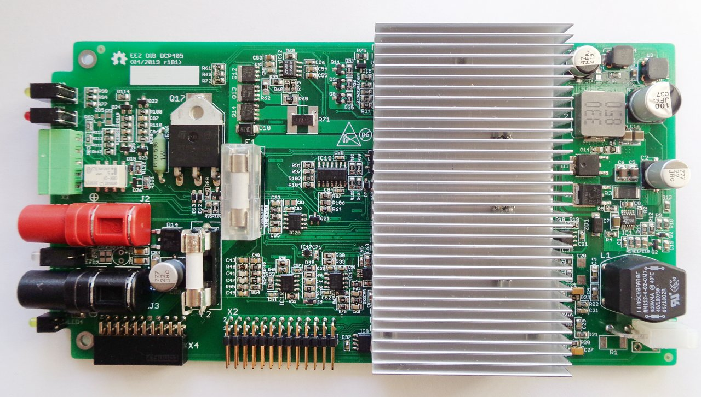

### Overview

The EEZ DIB DCP405 Power module is adopted EEZ H24005 [Power board](https://github.com/eez-open/psu-hw/tree/master/Power%20board) that can be housed in EEZ DIB chasis (e.g. _Bench Box 3_).

### Feature list
- Power input: 48 Vdc (e.g. Mean Well LRS-150F-48)
- Max. output power: 155 W (limited by Mean Well AC/DC module) 
- Voltage regulation (CV), 0 – 40 V. Voltage set resolution (_U_SET_): 16-bit, read resolution (_U_MON_): 15-bit
- Current regulation (CC) with 3-range (50 mA, 500 mA, 5 A) software auto-ranging function. Current set resolution (_I_SET_): 16-bit, Current read resolution (_I_MON_): 15-bit for each range
- On-board power pre-regulator and bias power supply
- **On-board OVP** with triac crowbar and two fuses
- Down-programmer
- Output enable (OE) circuit with LED indicator
- Fault LED indicator
-  On-board 4 mm power output terminals with standard (19.05 mm) pitch
- Pass-thru connector for serial and parallel coupling with other Power board
- Remote voltage sense with LED indicator and inverse polarity protection
- Remote voltage programming with LED indicator
- Galvanically isolated SPI bus for communication with [MCU board](https://github.com/eez-open/modular-psu/tree/master/mcu)
- I2C EEPROM for storing board specific configuration and calibration parameters
- I2C Temperature sensor
- Dimensions: 185 x 95 mm, 2-layer PCB

### r1B1 prototype (without front panel mounted)

