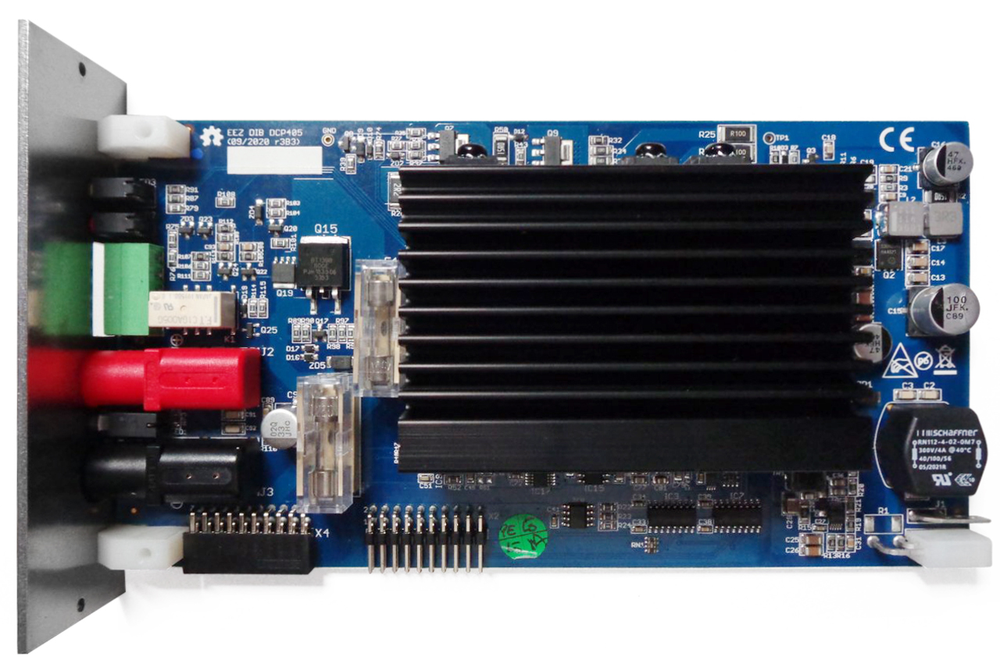

### Overview

The EEZ DIB DCP405 Power module is modified EEZ H24005 [Power board](https://github.com/eez-open/psu-hw/tree/master/Power%20board) that can be housed in EEZ DIB chasis (e.g. _Bench Box 3_). It comes with PNP "pass" element, OVP with triac crowbar, SPI temperature sensor and redesigned down-programmer new power pre-regulator and bias power supply.

### Feature list
- Power input: 48 Vdc (e.g. Mean Well LRS-150F-48 or EPP-150-48)
- Max. output power: 155 W (as limited with Mean Well AC/DC module capacity) 
- Voltage regulation (CV), 0 – 40 V. Voltage set resolution (_U_SET_): 16-bit, read resolution (_U_MON_): 15-bit
- Current regulation (CC) with 2-range (50 mA, 5 A). Current set resolution (_I_SET_): 16-bit, Current read resolution (_I_MON_): 15-bit for each range
- On-board low EMI switching power pre-regulator and bias power supply
- On-board OVP with full range dual crowbar (triac/MOSFET) and two fuses
- Down-programmer
- Output enable (OE) circuit with LED indicator combined with coupling indication
- On-board Ø4 mm safety sockets (19 mm/0.75” pitch) 
- Pass-thru connector for power output coupling with other power boards for e.g. doubling output voltage (up to 80 V) or current (up to 10 A)
- Remote voltage sense with LED indicator and inverse polarity protection
- Remote voltage programming with LED indicator (+2.5 V for full range)
- Galvanically isolated SPI bus for communication with [MCU board](https://github.com/eez-open/modular-psu/tree/master/mcu)
- I2C EEPROM for storing board specific configuration and calibration parameters
- SPI Temperature sensor
- Dimensions: 180 x 95 mm, 4-layer PCB
- **CE certified design**

