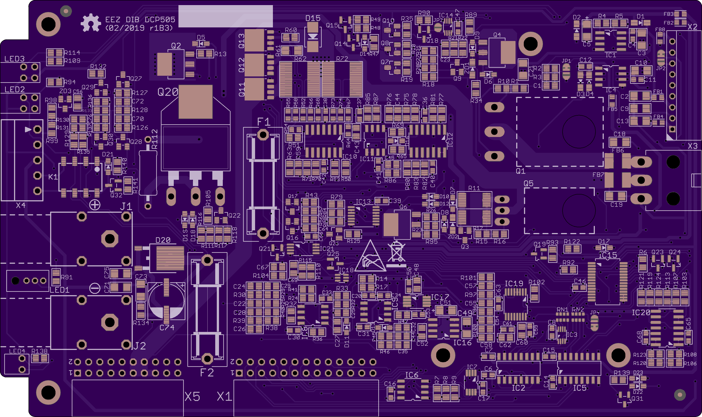
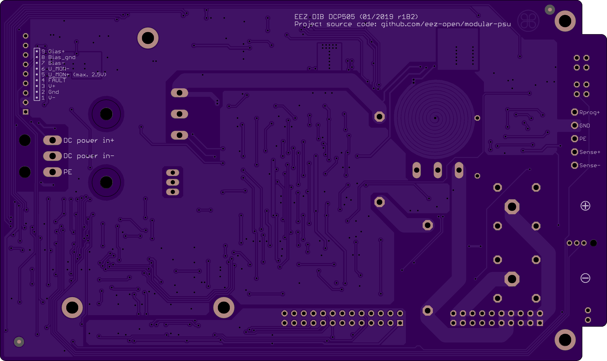

### Overview

The core of the EEZ DIB DCP505 Power board still represents adopted Leonid Ivanovitch design that is used in [EEZ H24005 Power board](https://github.com/eez-open/psu-hw/tree/master/Power%20board). The major improvements on this board include new form factor for housing in the EEZ DIB enclosure, 3-range autoranging circuit, OVP with triac and local EEPROM storage. 

### Feature list
- Power input: [EEZ CF-DIC]((https://github.com/eez-open/CF-DIC)_) power pre-regulator and bias power supply
- Power output: 250 W (max. 5 A)
- Voltage regulation (CV), 0 – 50 V. Voltage set (_U_SET_) resolution: 16-bit, read resolution (_U_MON_): 15-bit
- Current regulation (CC) with 3-range (50 mA, 500 mA, 5 A) **on-board auto-ranging circuit**. Current set resolution (_I_SET_): 16-bit over complete range (up to 21845 points per range: 0.23 mA / 23 uA, 2.3 uA increments), Current read resolution (_I_MON_): 15-bit for each range
- **On-board OVP** with triac and two fuses
- Down-programmer
- Temperature sensor (with SPI)
- Output enable (OE) circuit with LED indicator
- Fault/Powergood LED indicator
- On-board output terminals
- Pass-thru connector for serial and parallel coupling with other Power board
- Remote voltage sense with LED indicator and inverse polarity protection
- Remote voltage programming with LED indicator
- External digital trigger (3.3 or 5 V logic level)
- Galvanically isolated SPI bus for communication with [MCU board](https://github.com/eez-open/modular-psu/tree/master/mcu)
- I2C EEPROM for storing board specific configuration and calibration parameters
- Dimensions: 160 x 95 mm, 2-layer PCB

### Spice simulations

- [Current auto-ranging](https://github.com/eez-open/modular-psu/tree/master/dcp505/Spice/Auto-ranging) (LTspice)
- [OVP simulations](https://github.com/eez-open/modular-psu/tree/master/dcp505/Spice/OVP) (LTspice)

### PCB preview (r1B3)

