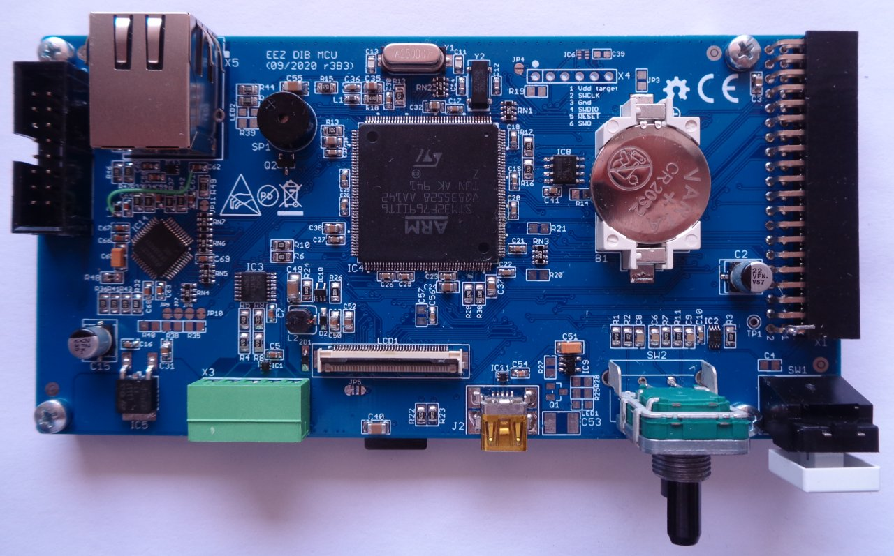
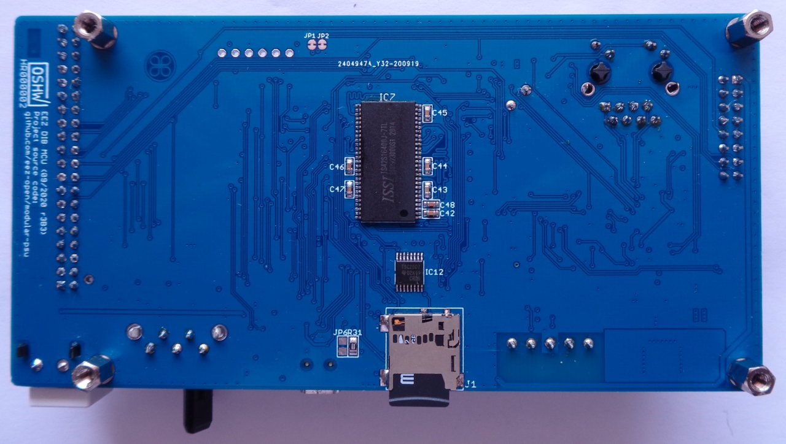

### Overview

_IMPORTANT: A crowdfunded version of the MCU module (r2B4) can be found [here](https://github.com/eez-open/modular-psu/tree/master/previous%20designs/mcu%20r2B4%20(Crowd%20Supply%20edition))._

STM32F7 MCU board for controlling up to 3 SPI peripheral modules, I2C fan controller, power soft-start/standby, TFT LCD with resistive touch controller, USB OTG, 10/100 Mbit/s Ethernet, SDRAM, EEPROM, rotary encoder, user switch, speaker and 2+2 digital I/O.

### r3B3 prototype

### Feature list

* [STM32F769IIT6](https://www.st.com/content/st_com/en/products/microcontrollers-microprocessors/stm32-32-bit-arm-cortex-mcus/stm32-high-performance-mcus/stm32f7-series/stm32f7x9/stm32f769ii.html) 32-bit ARM Cortex®-M7 MCU, 216 MHz, 2 MiB Flash, 512 KiB SRAM,  LQFP176 package
* Digital I/O: 2 x buffered inputs and 2 x buffered outputs. Alternative functions: UART, 1 x PWM
* Rotary encoder with switch
* 1 x user switch (use as BOOT0 for firmware loader on power up)
* 3 x SPI channels (2 x Chip selects per channel), 40-pin IDC connector (DIB v1.0)
* Battery backup (CR2032 button cell type)
* AC frequency (50/60 Hz) RTC reference (optional)
* External supervisor with watchdog (optional)
* USB FS, OTG
* Micro SD card
* [DP83848C](https://www.ti.com/product/DP83848C) Ethernet PHY (10/100 Mbit/s)
* 32 KiB I2C EEPROM
* SWG/JTAG connector (optional)
* 8 MiB SDRAM (e.g. [IS42S16400J](https://www.tme.eu/en/details/is42s16400j-7tli/dram-memories-integrated-circuits/issi/)) upgradeable to 32 MiB
* 0.5 mm FFC 40-pin connector for 4.3" TFT LCD 480 x 272 px display
* TFT backlight brightness control
* Resistive touch controller (I2C)
* Soft-start/stand-by control lines for [AUX PS board](https://github.com/eez-open/modular-psu/tree/master/aux-ps)
* Small on-board speaker
* Input power: +5 V (+12 V pass-thru to peripheral modules)
* On board +3.3 V LDO
* Dimensions: 139.5 x 70 mm, 4-layer PCB
* **CE certified design**
