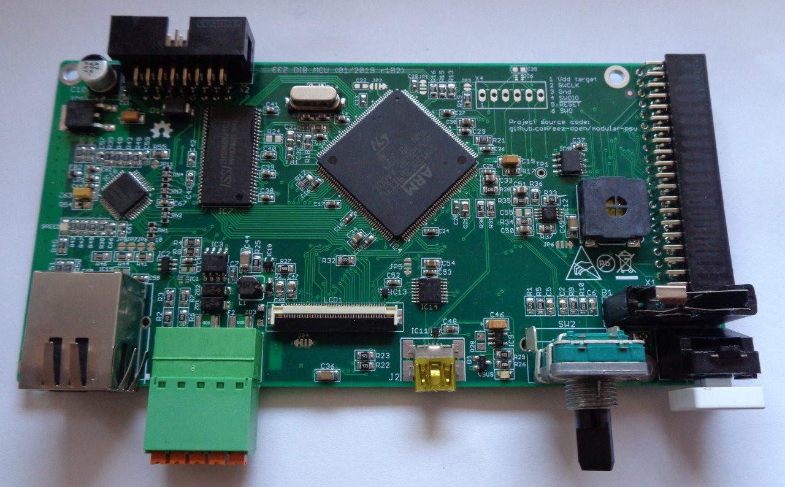

STM32F7 MCU board for controlling up to 3 SPI peripheral modules, I2C fan controller, power soft-start/stand-by, TFT LCD with resistive touch controller, USB 2.0, 10/100 Mbit/s Ethernet, SDRAM, EEPROM, audio amplifier, rotary encoder, user switch and 4 I/O

### Feature list

* [STM32F769IIT6](https://www.st.com/content/st_com/en/products/microcontrollers-microprocessors/stm32-32-bit-arm-cortex-mcus/stm32-high-performance-mcus/stm32f7-series/stm32f7x9/stm32f769ii.html) 32-bit ARM Cortex®-M7 MCU, 216 MHz, 2 MiB Flash, 512 KiB SRAM,  LQFP176 package
* Digital I/O: 2 x protected inputs, 2 x protected outputs
* Rotary encoder with switch
* 1 x user switch
* 3 x SPI channels (2 x Chip selects per channel), 40-pin IDC connector (DIB v1.0)
* Battery backup (CR2032 button cell type)
* USB 2.0 OTG
* Micro SD card
* [DP83848C](https://www.ti.com/product/DP83848C) Ethernet PHY (10/100 Mbit/s)
* I2C EEPROM
* JTAG connector (optional)
* SDRAM (e.g. [IS42S16400J](https://www.tme.eu/en/details/is42s16400j-7tli/dram-memories-integrated-circuits/issi/))
* TFT LCD 0.5 mm FFC 40-pin connector (e.g. 4.3" [RFE43BH-AIW-DNS](https://www.tme.eu/en/details/rfe43bh-aiw-dns/tft-displays/raystar-optronics/) or [RFE430Y-AIW-DNS](https://www.tme.eu/en/details/rfe430y-aiw-dns/tft-displays/raystar-optronics/))
* TFT backlight brightness control
* Resistive touch controller
* Soft-start/stand-by control lines for [AUX PS board](https://github.com/eez-open/modular-psu/tree/master/aux-ps)
* Audio amplifier with small on-board speaker
* Input power: +5 V (+12 V pass-thru to peripheral modules)
* On board +3.3 V LDO
* Bootloader select for USB DFU
* Dimensions: 139 x 70 mm, 4-layer PCB

### r1B2 prototype

